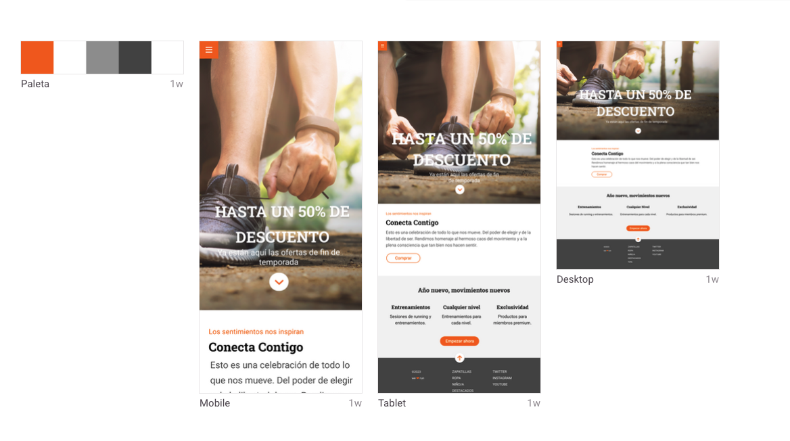

# Module: 1 Final evaluation exercise
Build a responsive Home page for Adalab final module 1 exercise.

### Built With:
- HTML
- SCSS
- Adalab Web Starter Kit

### Challenges I have faced
The very first challenge was to adapt the image in the hero for all devices.

### Features to implement in the future
**Transform**, **transition** and **animation** properties for the buttons.

### Getting Started

Clone the repo:
* `git clone https://github.com/your_username_/Project-Name.git`

Install NPM packages:
* `npm install`

Start the project: 
* `npm start`

### License
Distributed under the MIT License. See LICENSE.txt for more information.

### What I've learned
> For every minute spent in organizing, an hour is earned.
> — Benjamin Franklin

### Contact me
[Enrica Garcia](https://www.linkedin.com/in/enrica-garcia-69541a208/)

Project Link: https://github.com/your_username/repo_name